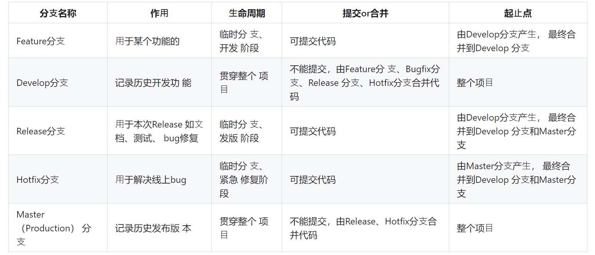

# GitFlow for deep learning

Let's take continual few shot learning as an example!
## create develop branch
+ ... init project and commit
+ git checkout -b develop master
## create feature branch
Feature consists of two parts in DL: **problem_setting** and **modules**.
+ git checkout -b cfl_setting
+ ... add feature and commit
+ git checkout develop
+ git merge --no-ff cfl_setting
+ git branch -d cfl_setting
## create release branch
This branch is used for test.
+ git checkout -b release-cfl
+ ... test, fix bug and commit
+ git checkout develop
+ git merge --no-ff release-cfl
+ git checkout master
+ git merge --no-ff release-cfl
+ git tag v0.1_cfl_setting
## Commit formate

<header> build fix test
<BLANK LINE>
<body> summary 
<BLANK LINE>
<footer>

