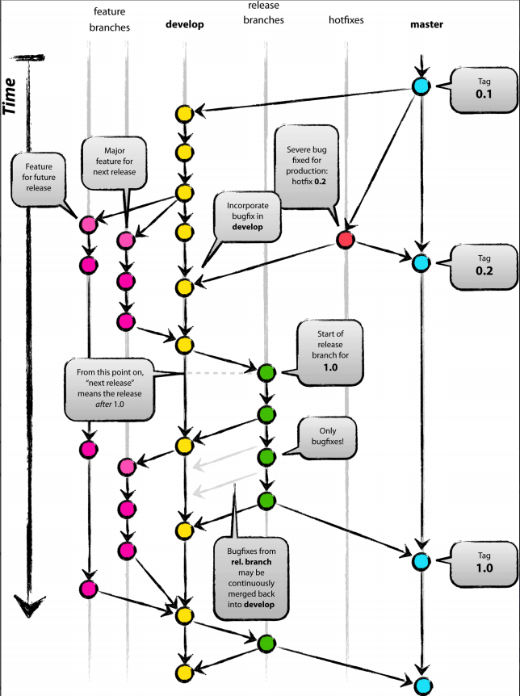

## create develop branch
+ ... init project and commit 
+ `git checkout -b develop master`
## create feature branch
In deep learning project, feature consists of two parts: **problem setting** and **module**. Let's take continual few shot learning project as an example.
+ `git checkout -b cfl_setting develop`
+ `git checkout develop`
+ `git merge --no-ff cfl_setting`
+ `git branch -d cfl_setting`

